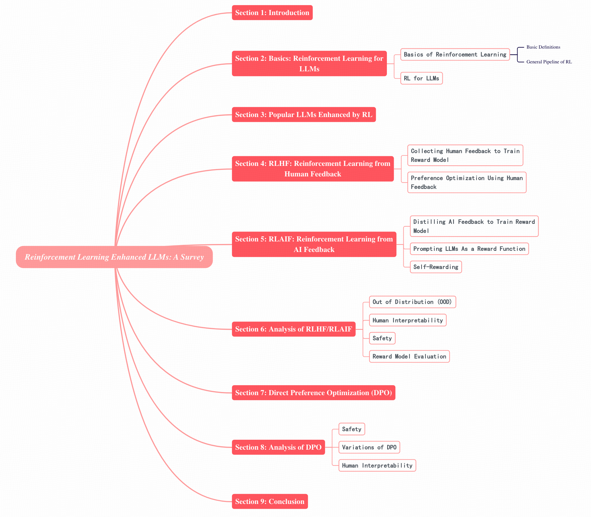

# Reinforcement-Learning-Enhanced-LLMs-A-Survey


This repository contains resources referenced in the paper [Reinforcement Learning Enhanced LLMs: A Survey](https://arxiv.org/abs/2412.10400). 

If you find this repository helpful, please cite the following:
```latex
@misc{wang2024reinforcementlearningenhancedllms,
      title={Reinforcement Learning Enhanced LLMs: A Survey}, 
      author={Shuhe Wang and Shengyu Zhang and Jie Zhang and Runyi Hu and Xiaoya Li and Tianwei Zhang and Jiwei Li and Fei Wu and Guoyin Wang and Eduard Hovy},
      year={2024},
      eprint={2412.10400},
      archivePrefix={arXiv},
      primaryClass={cs.CL},
      url={https://arxiv.org/abs/2412.10400}, 
}
```


## 🥳 News 

**Stay tuned! More related work will be updated!**
* **[17 Dec, 2024]** The repository is created. 
* **[5 Dec, 2024]** We release the first version of the paper.


## Table of Contents
- [Reinforcement-Learning-Enhanced-LLMs-A-Survey](#reinforcement-learning-enhanced-llms-a-survey)
  - [🥳 News](#-news)
  - [Table of Contents](#table-of-contents)
  - [Overview](#overview)
  - [Popular LLMs Enhanced by RL](#popular-llms-enhanced-by-rl)
    - [Related Papers](#related-papers)
  - [RLHF: Reinforcement Learning from Human Feedback](#rlhf-reinforcement-learning-from-human-feedback)
    - [Related Papers](#related-papers-1)
      - [Collecting Human Feedback to Train Reward Model](#collecting-human-feedback-to-train-reward-model)
      - [Preference Optimization Using Human Feedback](#preference-optimization-using-human-feedback)
  - [RLAIF: Reinforcement Learning from AI Feedback](#rlaif-reinforcement-learning-from-ai-feedback)
    - [Related Papers](#related-papers-2)
      - [Distilling AI Feedback to Train Reward Model](#distilling-ai-feedback-to-train-reward-model)
      - [Prompting LLMs As a Reward Function](#prompting-llms-as-a-reward-function)
      - [Self-Rewarding](#self-rewarding)
  - [Analysis of RLHF/RLAIF](#analysis-of-rlhfrlaif)
    - [Related Papers](#related-papers-3)
      - [Out of Distribution (OOD)](#out-of-distribution-ood)
      - [Human Interpretability](#human-interpretability)
      - [Safety](#safety)
      - [Reward Model Evaluation](#reward-model-evaluation)
  - [Direct Preference Optimization (DPO)](#direct-preference-optimization-dpo)
    - [Related Papers](#related-papers-4)
  - [Analysis of DPO](#analysis-of-dpo)
    - [Related Papers](#related-papers-5)
      - [Reward Model Evaluation](#reward-model-evaluation-1)
      - [Variations of DPO](#variations-of-dpo)
      - [Human Interpretability](#human-interpretability-1)
  - [Contact](#contact)


## Overview

The [paper](https://arxiv.org/abs/2412.10400) surveys research in the rapidly growing field of enhancing large language models
(LLMs) with reinforcement learning (RL), a
technique that enables LLMs to improve their
performance by receiving feedback in the form
of rewards based on the quality of their outputs,
allowing them to generate more accurate, coherent, and contextually appropriate responses.
In this work, we make a systematic review of
the most up-to-date state of knowledge on RLenhanced LLMs, attempting to consolidate and
analyze the rapidly growing research in this
field, helping researchers understand the current challenges and advancements. 

Specifically,
we (1) detail the basics of RL; (2) introduce
popular RL-enhanced LLMs; (3) review researches on two widely-used reward modelbased RL techniques: Reinforcement Learning
from Human Feedback (RLHF) and Reinforcement Learning from AI Feedback (RLAIF);
and (4) explore Direct Preference Optimization
(DPO), a set of methods that bypass the reward
model to directly use human preference data
for aligning LLM outputs with human expectations. We will also point out current challenges
and deficiencies of existing methods and suggest some avenues for further improvements


The typology of the paper is as follows: 

<div align="center">
  
</div>


## Popular LLMs Enhanced by RL

<table border="1" style="text-align:center;">
<tr>
        <th>RL Enhanced LLMs</th>
        <th>Organization</th> 
        <th># Params</th> 
        <th>Project</th>
        <th>Paper</th>
        <th>Open Source</th>
</tr>
<tr>
        <td>Instruct-GPT [<a href="#ref1">1</a>]</td>
        <td>OpenAI</td> 
        <td>1.3B, 6B, 175B</td> 
        <td><a href="https://github.com/openai/following-instructions-human-feedback" target="_blank">project</a></td>
        <td><a href="https://arxiv.org/abs/2203.02155" target="_blank">paper</a></td>
        <td>No</td>
</tr>

<tr>
        <td>GPT-4 [<a href="#ref2">2</a>]</td>
        <td>OpenAI</td> 
        <td>-</td> 
        <td>-</td>
        <td><a href="https://arxiv.org/abs/2303.08774" target="_blank">paper</a></td>
        <td>No</td>
</tr>

<tr>
        <td>Gemini  [<a href="#ref3">3</a>]</td>
        <td>Google</td> 
        <td>-</td> 
        <td>-</td>
        <td><a href="https://arxiv.org/abs/2312.11805" target="_blank">paper</a></td>
        <td>No</td>
</tr>

<tr>
        <td>InternLM2   [<a href="#ref4">4</a>]</td>
        <td>Shanghai AI Laboratory</td> 
        <td>1.8B, 7B, 20B</td> 
        <td><a href="https://github.com/InternLM/InternLM" target="_blank">project</a></td>
        <td><a href="https://arxiv.org/abs/2403.17297" target="_blank">paper</a></td>
        <td>Yes</td>
</tr>

<tr>
        <td>Claude 3   [<a href="#ref5">5</a>]</td>
        <td>Anthropic</td> 
        <td>-</td> 
        <td><a href="https://www.anthropic.com/news/claude-3-5-sonnet" target="_blank">project</a></td>
        <td>-</td>
        <td>No</td>
</tr>

<tr>
        <td>Reka   [<a href="#ref6">6</a>]</td>
        <td>Reka</td> 
        <td>7B, 21B</td> 
        <td><a href="https://showcase.reka.ai/" target="_blank">project</a></td>
        <td><a href="https://arxiv.org/abs/2404.12387" target="_blank">paper</a></td>
        <td>No</td>
</tr>

<tr>
        <td>Zephyr   [<a href="#ref7">7</a>]</td>
        <td>Argilla</td> 
        <td>141B-A39B</td> 
        <td><a href="https://huggingface.co/HuggingFaceH4/zephyr-orpo-141b-A35b-v0.1" target="_blank">project</a></td>
        <td>-</td>
        <td>Yes</td>
</tr>

<tr>
        <td>Phi-3   [<a href="#ref8">8</a>]</td>
        <td>Microsoft</td> 
        <td>3.8B, 7B, 14B</td> 
        <td><a href="https://huggingface.co/collections/microsoft/phi-3-6626e15e9585a200d2d761e3" target="_blank">project</a></td>
        <td><a href="https://arxiv.org/abs/2404.14219" target="_blank">paper</a></td>
        <td>Yes</td>
</tr>

<tr>
        <td>DeepSeek-V2   [<a href="#ref9">9</a>]</td>
        <td>DeepSeek-AI</td> 
        <td>236B-A21B</td> 
        <td><a href="https://github.com/deepseek-ai/DeepSeek-V2" target="_blank">project</a></td>
        <td><a href="https://arxiv.org/abs/2405.04434" target="_blank">paper</a></td>
        <td>Yes</td>
</tr>

<tr>
        <td>ChatGLM   [<a href="#ref10">10</a>]</td>
        <td>Team GLM</td> 
        <td>6B, 9B</td> 
        <td><a href="https://github.com/THUDM" target="_blank">project</a></td>
        <td><a href="https://arxiv.org/abs/2406.12793" target="_blank">paper</a></td>
        <td>Yes</td>
</tr>

<tr>
        <td>Nemotron-4 340B    [<a href="#ref11">11</a>]</td>
        <td>NVIDIA</td> 
        <td>340B</td> 
        <td><a href="https://blogs.nvidia.com/blog/nemotron-4-synthetic-data-generation-llm-training/" target="_blank">project</a></td>
        <td><a href="https://arxiv.org/abs/2406.11704v1" target="_blank">paper</a></td>
        <td>Yes</td>
</tr>

<tr>
        <td>Llama 3    [<a href="#ref12">12</a>]</td>
        <td>Meta</td> 
        <td>8B, 70B, 405B</td> 
        <td><a href="https://huggingface.co/collections/meta-llama/meta-llama-3-66214712577ca38149ebb2b6" target="_blank">project</a></td>
        <td><a href="https://arxiv.org/abs/2407.21783" target="_blank">paper</a></td>
        <td>Yes</td>
</tr>

<tr>
        <td>Qwen2    [<a href="#ref13">13</a>]</td>
        <td>Qwen Team, Alibaba Group</td> 
        <td>(0.5-72)B, 57B-A14B</td> 
        <td><a href="https://github.com/QwenLM/Qwen2.5" target="_blank">project</a></td>
        <td><a href="https://arxiv.org/abs/2407.10671" target="_blank">paper</a></td>
        <td>Yes</td>
</tr>

<tr>
        <td>Gemma2     [<a href="#ref14">14</a>]</td>
        <td>Google</td> 
        <td>2B, 9B, 27B</td> 
        <td><a href="https://huggingface.co/collections/google/gemma-2-release-667d6600fd5220e7b967f315" target="_blank">project</a></td>
        <td><a href="https://arxiv.org/abs/2408.00118" target="_blank">paper</a></td>
        <td>Yes</td>
</tr>

<tr>
        <td>Starling-7B     [<a href="#ref15">15</a>]</td>
        <td>Berkeley</td> 
        <td>7B</td> 
        <td><a href="https://huggingface.co/berkeley-nest/Starling-RM-7B-alpha" target="_blank">project</a></td>
        <td><a href="https://starling.cs.berkeley.edu/" target="_blank">paper</a></td>
        <td>Yes</td>
</tr>

<tr>
        <td>Athene-70B     [<a href="#ref16">16</a>]</td>
        <td>Nexusflow</td> 
        <td>70B</td> 
        <td><a href="https://huggingface.co/Nexusflow/Athene-70B" target="_blank">project</a></td>
        <td><a href="https://nexusflow.ai/blogs/athene" target="_blank">paper</a></td>
        <td>Yes</td>
</tr>

<tr>
        <td>Hermes 3 [<a href="#ref17">17</a>]</td>
        <td>Nous Research</td> 
        <td>8B, 70B, 405B</td> 
        <td><a href="https://huggingface.co/collections/NousResearch/hermes-3-66bd6c01399b14b08fe335ea" target="_blank">project</a></td>
        <td><a href="https://arxiv.org/abs/2408.11857" target="_blank">paper</a></td>
        <td>Yes</td>
</tr>

<tr>
        <td>o1 [<a href="#ref18">18</a>]</td>
        <td>OpenAI</td> 
        <td>-</td> 
        <td><a href="https://openai.com/index/hello-gpt-4o" target="_blank">project</a></td>
        <td>-</td>
        <td>No</td>
</tr>

<tr>
        <td>Kimi-k1.5 [<a href="#ref19">19</a>]</td>
        <td>Moonshot AI</td> 
        <td>-</td> 
        <td>-</td>
        <td><a href="https://arxiv.org/abs/2501.12599" target="_blank">paper</a></td>
        <td>No</td>
</tr>

<tr>
        <td>DeepSeek-R1 [<a href="#ref20">20</a>]</td>
        <td>DeepSeek</td> 
        <td>671B-A31B</td> 
        <td><a href="https://github.com/deepseek-ai/DeepSeek-R1/tree/main" target="_blank">project</a></td>
        <td><a href="https://arxiv.org/abs/2501.12948" target="_blank">paper</a></td>
        <td>Yes</td>
</tr>
</table>

### Related Papers
<a id="ref1">[1]</a> Ouyang, Long and Wu, Jeffrey and Jiang, Xu and Almeida, Diogo and Wainwright, Carroll and Mishkin, Pamela and Zhang, Chong and Agarwal, Sandhini and Slama, Katarina and Ray, Alex and others. **Training language models to follow instructions with human feedback**. Advances in neural information processing systems. [Paper](https://arxiv.org/abs/2203.02155)

<a id="ref2">[2]</a> OpenAI. **GPT-4 Technical Report**. arXiv. [Paper](https://arxiv.org/abs/2303.08774)

<a id="ref3">[3]</a> Team, Gemini and Anil, Rohan and Borgeaud, Sebastian and Alayrac, Jean-Baptiste and Yu, Jiahui and Soricut, Radu and Schalkwyk, Johan and Dai, Andrew M and Hauth, Anja and Millican, Katie and others. **Gemini: a family of highly capable multimodal models**. arXiv preprint arXiv:2312.11805. [Paper](https://arxiv.org/abs/2312.11805)

<a id="ref4">[4]</a> Cai, Zheng and Cao, Maosong and Chen, Haojiong and Chen, Kai and Chen, Keyu and Chen, Xin and Chen, Xun and Chen, Zehui and Chen, Zhi and Chu, Pei and others. **Internlm2 technical report**. arXiv preprint arXiv:2403.17297. [Paper](https://arxiv.org/abs/2403.17297)

<a id="ref5">[5]</a> Anthropic. **Claude 3 Family**. [Project](https://www.anthropic.com/news/claude-3-5-sonnet)

<a id="ref6">[6]</a> Team, Reka and Ormazabal, Aitor and Zheng, Che and d'Autume, Cyprien de Masson and Yogatama, Dani and Fu, Deyu and Ong, Donovan and Chen, Eric and Lamprecht, Eugenie and Pham, Hai and others. **Reka core, flash, and edge: A series of powerful multimodal language models**. arXiv preprint arXiv:2404.12387. [Paper](https://arxiv.org/abs/2404.12387)

<a id="ref7">[7]</a> HuggingFaceH4. **Zephyr-ORPO-141b-A35b-v0.1**. [Project](https://huggingface.co/HuggingFaceH4/zephyr-orpo-141b-A35b-v0.1)

<a id="ref8">[8]</a> Abdin, Marah and Aneja, Jyoti and Awadalla, Hany and Awadallah, Ahmed and Awan, Ammar Ahmad and Bach, Nguyen and Bahree, Amit and Bakhtiari, Arash and Bao, Jianmin and Behl, Harkirat and others. **Phi-3 technical report: A highly capable language model locally on your phone**. arXiv preprint arXiv:2404.14219. [Paper](https://arxiv.org/abs/2404.14219)

<a id="ref9">[9]</a> Liu, Aixin and Feng, Bei and Wang, Bin and Wang, Bingxuan and Liu, Bo and Zhao, Chenggang and Dengr, Chengqi and Ruan, Chong and Dai, Damai and Guo, Daya and others. **Deepseek-v2: A strong, economical, and efficient mixture-of-experts language model**. arXiv preprint arXiv:2405.04434. [Paper](https://arxiv.org/abs/2405.04434)

<a id="ref10">[10]</a> GLM, Team and Zeng, Aohan and Xu, Bin and Wang, Bowen and Zhang, Chenhui and Yin, Da and Rojas, Diego and Feng, Guanyu and Zhao, Hanlin and Lai, Hanyu and others. **ChatGLM: A Family of Large Language Models from GLM-130B to GLM-4 All Tools**. arXiv preprint arXiv:2406.12793. [Paper](https://arxiv.org/abs/2406.12793)

<a id="ref11">[11]</a> Adler, Bo and Agarwal, Niket and Aithal, Ashwath and Anh, Dong H and Bhattacharya, Pallab and Brundyn, Annika and Casper, Jared and Catanzaro, Bryan and Clay, Sharon and Cohen, Jonathan and others. **Nemotron-4 340B Technical Report**. arXiv preprint arXiv:2406.11704. [Paper](https://arxiv.org/abs/2406.11704v1)

<a id="ref12">[12]</a> Dubey, Abhimanyu and Jauhri, Abhinav and Pandey, Abhinav and Kadian, Abhishek and Al-Dahle, Ahmad and Letman, Aiesha and Mathur, Akhil and Schelten, Alan and Yang, Amy and Fan, Angela and others. **The llama 3 herd of models**. arXiv preprint arXiv:2407.21783. [Paper](https://arxiv.org/abs/2407.21783)

<a id="ref13">[13]</a> Yang, An and Yang, Baosong and Hui, Binyuan and Zheng, Bo and Yu, Bowen and Zhou, Chang and Li, Chengpeng and Li, Chengyuan and Liu, Dayiheng and Huang, Fei and others. **Qwen2 technical report**. arXiv preprint arXiv:2407.10671. [Paper](https://arxiv.org/abs/2407.10671)

<a id="ref14">[14]</a> Team, Gemma and Riviere, Morgane and Pathak, Shreya and Sessa, Pier Giuseppe and Hardin, Cassidy and Bhupatiraju, Surya and Hussenot, L{\'e}onard and Mesnard, Thomas and Shahriari, Bobak and Ram{\'e}, Alexandre and others. **Gemma 2: Improving open language models at a practical size**. arXiv preprint arXiv:2408.00118. [Paper](https://arxiv.org/abs/2408.00118)

<a id="ref15">[15]</a> Zhu, Banghua and Frick, Evan and Wu, Tianhao and Zhu, Hanlin and Ganesan, Karthik and Chiang, Wei-Lin and Zhang, Jian and Jiao, Jiantao. **Starling-7b: Improving helpfulness and harmlessness with RLAIF**. First Conference on Language Modeling. [Paper](https://starling.cs.berkeley.edu/)

<a id="ref16">[16]</a> Nexusflow. **Athene-Llama3-70B: Advancing Open-Weight Chat Models**. [Paper](https://nexusflow.ai/blogs/athene)

<a id="ref17">[17]</a> Teknium, Ryan and Quesnelle, Jeffrey and Guang, Chen. **Hermes 3 technical report**. arXiv preprint arXiv:2408.11857. [Paper](https://arxiv.org/abs/2408.11857)

<a id="ref18">[18]</a> OpenAI. **Hello, {GPT}-4o**. [Project](https://openai.com/index/hello-gpt-4o/)

<a id="ref19">[19]</a> Kimi Team et al., 2025. **Kimi k1.5: Scaling Reinforcement Learning with LLMs**. arXiv preprint arXiv:2501.12599. [Paper](https://arxiv.org/abs/2501.12599)

<a id="ref20">[20]</a> DeepSeek-AI et al., 2025. **DeepSeek-R1: Incentivizing Reasoning Capability in LLMs via Reinforcement Learning**. arXiv preprint arXiv:2501.12948. [Paper](https://arxiv.org/abs/2501.12948)


## RLHF: Reinforcement Learning from Human Feedback
Reinforcement learning from human feedback (RLHF) is a training approach that combines reinforcement learning (RL) with human feedback to align LLMs with human values, preferences, and expectations.
RLHF consists of two main components: **(1) Collecting Human Feedback to Train Reward Model**, where human evaluators provide feedback on the LLM's outputs by scoring or ranking responses based on factors such as quality and relevance. This feedback is then used to train a reward model that predicts the quality of the outputs and serves as the reward function in the RL process; and **(2) Preference Optimization Using Human Feedback**, where the trained reward model guides the optimization of the LLM's outputs to maximize predicted rewards, aligning the LLM's behavior with human preferences.

### Related Papers

#### Collecting Human Feedback to Train Reward Model

<a id="ref1">[1]</a> Liu, Chris Yuhao and Zeng, Liang and Liu, Jiacai and Yan, Rui and He, Jujie and Wang, Chaojie and Yan, Shuicheng and Liu, Yang and Zhou, Yahui. **Skywork-Reward: Bag of Tricks for Reward Modeling in LLMs**. arXiv preprint arXiv:2410.18451. [Paper](https://arxiv.org/abs/2410.18451)

<a id="ref2">[2]</a> Ivison, Hamish and Wang, Yizhong and Pyatkin, Valentina and Lambert, Nathan and Peters, Matthew and Dasigi, Pradeep and Jang, Joel and Wadden, David and Smith, Noah A and Beltagy, Iz and others. **Camels in a changing climate: Enhancing lm adaptation with tulu 2**. arXiv preprint arXiv:2311.10702. [Paper](https://arxiv.org/abs/2311.10702)

#### Preference Optimization Using Human Feedback

<a id="ref1">[1]</a> Yuan, Zheng and Yuan, Hongyi and Tan, Chuanqi and Wang, Wei and Huang, Songfang and Huang, Fei. **Rrhf: Rank responses to align language models with human feedback without tears**. arXiv preprint arXiv:2304.05302. [Paper](https://arxiv.org/abs/2304.05302)

<a id="ref2">[2]</a> Ahmadian, Arash and Cremer, Chris and Gall{\'e}, Matthias and Fadaee, Marzieh and Kreutzer, Julia and Pietquin, Olivier and {\"U}st{\"u}n, Ahmet and Hooker, Sara. **Back to basics: Revisiting reinforce style optimization for learning from human feedback in llms**. arXiv preprint arXiv:2402.14740. [Paper](https://arxiv.org/abs/2402.14740)

<a id="ref3">[3]</a> Song, Feifan and Yu, Bowen and Li, Minghao and Yu, Haiyang and Huang, Fei and Li, Yongbin and Wang, Houfeng. **Preference ranking optimization for human alignment**. Proceedings of the AAAI Conference on Artificial Intelligence. [Paper](https://arxiv.org/abs/2306.17492)

<a id="ref4">[4]</a> Swamy, Gokul and Dann, Christoph and Kidambi, Rahul and Wu, Zhiwei Steven and Agarwal, Alekh. **A minimaximalist approach to reinforcement learning from human feedback**. arXiv preprint arXiv:2401.04056. [Paper](https://arxiv.org/abs/2401.04056)


## RLAIF: Reinforcement Learning from AI Feedback
Reinforcement learning from AI feedback (RLAIF) serves as a promising alternative or supplement to RLHF that leverages AI systems—often more powerful or specialized LLMs (e.g., GPT-4)—to provide feedback on the outputs of the LLM being trained. This approach provides benefits such as scalability, consistency, and cost efficiency while minimizing reliance on human evaluators. 
Below, we explore several methods for substituting human feedback with AI feedback in reinforcement learning, highlighting approaches: (1) Distilling AI Feedback to Train Reward Model, (2) Prompting LLMs As a Reward Function, and (3) Self-Rewarding.

### Related Papers

#### Distilling AI Feedback to Train Reward Model

<a id="ref1">[1]</a> Cui, Ganqu and Yuan, Lifan and Ding, Ning and Yao, Guanming and Zhu, Wei and Ni, Yuan and Xie, Guotong and Liu, Zhiyuan and Sun, Maosong. **Ultrafeedback: Boosting language models with high-quality feedback**. arXiv preprint arXiv:2310.01377. [Paper](https://arxiv.org/abs/2310.01377)

<a id="ref2">[2]</a> Xu, Zhangchen and Jiang, Fengqing and Niu, Luyao and Deng, Yuntian and Poovendran, Radha and Choi, Yejin and Lin, Bill Yuchen. **Magpie: Alignment Data Synthesis from Scratch by Prompting Aligned LLMs with Nothing**. arXiv preprint arXiv:2406.08464. [Paper](https://arxiv.org/abs/2406.08464)

<a id="ref3">[3]</a> Wang, Zhilin and Dong, Yi and Delalleau, Olivier and Zeng, Jiaqi and Shen, Gerald and Egert, Daniel and Zhang, Jimmy J and Sreedhar, Makesh Narsimhan and Kuchaiev, Oleksii. **HelpSteer2: Open-source dataset for training top-performing reward models**. arXiv preprint arXiv:2406.08673. [Paper](https://arxiv.org/abs/2406.08673)

<a id="ref4">[4]</a> Park, Junsoo and Jwa, Seungyeon and Ren, Meiying and Kim, Daeyoung and Choi, Sanghyuk. **Offsetbias: Leveraging debiased data for tuning evaluators**. arXiv preprint arXiv:2407.06551. [Paper](https://arxiv.org/abs/2407.06551)


#### Prompting LLMs As a Reward Function

<a id="ref1">[1]</a> Du, Yuqing and Watkins, Olivia and Wang, Zihan and Colas, C{\'e}dric and Darrell, Trevor and Abbeel, Pieter and Gupta, Abhishek and Andreas, Jacob. **Guiding pretraining in reinforcement learning with large language models**. International Conference on Machine Learning. [Paper](https://arxiv.org/abs/2302.06692)

<a id="ref2">[2]</a> Kwon, Minae and Xie, Sang Michael and Bullard, Kalesha and Sadigh, Dorsa. **Reward design with language models**. arXiv preprint arXiv:2303.00001. [Paper](https://arxiv.org/abs/2303.00001)

<a id="ref3">[3]</a> Ma, Yecheng Jason and Liang, William and Wang, Guanzhi and Huang, De-An and Bastani, Osbert and Jayaraman, Dinesh and Zhu, Yuke and Fan, Linxi and Anandkumar, Anima. **Eureka: Human-level reward design via coding large language models**. arXiv preprint arXiv:2310.12931. [Paper](https://arxiv.org/abs/2310.12931)

<a id="ref4">[4]</a> Xie, Tianbao and Zhao, Siheng and Wu, Chen Henry and Liu, Yitao and Luo, Qian and Zhong, Victor and Yang, Yanchao and Yu, Tao. **Text2reward: Automated dense reward function generation for reinforcement learning**. arXiv preprint arXiv:2309.11489. [Paper](https://arxiv.org/abs/2309.11489)

<a id="ref5">[5]</a> Lee, Harrison and Phatale, Samrat and Mansoor, Hassan and Lu, Kellie and Mesnard, Thomas and Bishop, Colton and Carbune, Victor and Rastogi, Abhinav. **Rlaif: Scaling reinforcement learning from human feedback with ai feedback**. arXiv preprint arXiv:2309.00267. [Paper](https://arxiv.org/abs/2309.00267)

<a id="ref6">[6]</a> Zhang, Lunjun and Hosseini, Arian and Bansal, Hritik and Kazemi, Mehran and Kumar, Aviral and Agarwal, Rishabh. **Generative verifiers: Reward modeling as next-token predictionk**. arXiv preprint arXiv:2408.15240. [Paper](https://arxiv.org/abs/2408.15240)


#### Self-Rewarding

<a id="ref1">[1]</a> Song, Jiayang and Zhou, Zhehua and Liu, Jiawei and Fang, Chunrong and Shu, Zhan and Ma, Lei. **Self-refined large language model as automated reward function designer for deep reinforcement learning in robotics**. arXiv preprint arXiv:2309.06687. [Paper](https://arxiv.org/abs/2309.06687)

<a id="ref2">[2]</a> Yuan, Weizhe and Pang, Richard Yuanzhe and Cho, Kyunghyun and Sukhbaatar, Sainbayar and Xu, Jing and Weston, Jason. **Self-rewarding language models**. arXiv preprint arXiv:2401.10020. [Paper](https://arxiv.org/abs/2401.10020)

<a id="ref3">[3]</a> Ye, Ziyi and Li, Xiangsheng and Li, Qiuchi and Ai, Qingyao and Zhou, Yujia and Shen, Wei and Yan, Dong and Liu, Yiqun. **Beyond Scalar Reward Model: Learning Generative Judge from Preference Data**. arXiv preprint arXiv:2410.03742. [Paper](https://arxiv.org/abs/2410.03742)


## Analysis of RLHF/RLAIF
While RLHF and RLAIF are effective methods for aligning LLMs with desired behaviors, there are still challenges that require careful analysis. These include addressing out-of-distribution issues between the trained reward models and the aligned LLMs, ensuring the interpretability of the model for humans, and maintaining safety and evaluation benchmarks to train robust reward models. 
In this section, we discuss recent works that tackle these challenges and provide strategies for overcoming them.

### Related Papers

#### Out of Distribution (OOD)

<a id="ref1">[1]</a> Lou, Xingzhou and Yan, Dong and Shen, Wei and Yan, Yuzi and Xie, Jian and Zhang, Junge. **Uncertainty-aware reward model: Teaching reward models to know what is unknown**. arXiv preprint arXiv:2410.00847. [Paper](https://arxiv.org/abs/2410.00847)

<a id="ref2">[2]</a> Yang, Rui and Ding, Ruomeng and Lin, Yong and Zhang, Huan and Zhang, Tong. **Regularizing Hidden States Enables Learning Generalizable Reward Model for LLMs**. arXiv preprint arXiv:2406.10216. [Paper](https://arxiv.org/abs/2406.10216)


#### Human Interpretability

<a id="ref1">[1]</a> Wang, Haoxiang and Xiong, Wei and Xie, Tengyang and Zhao, Han and Zhang, Tong. **Interpretable Preferences via Multi-Objective Reward Modeling and Mixture-of-Experts**. arXiv preprint arXiv:2406.12845. [Paper](https://arxiv.org/abs/2406.12845)

<a id="ref2">[2]</a> Dorka, Nicolai. **Quantile Regression for Distributional Reward Models in RLHF**. arXiv preprint arXiv:2409.10164. [Paper](https://arxiv.org/abs/2409.10164)

<a id="ref3">[3]</a> Zhang, Yifan and Zhang, Ge and Wu, Yue and Xu, Kangping and Gu, Quanquan. **General Preference Modeling with Preference Representations for Aligning Language Models**. arXiv preprint arXiv:2410.02197. [Paper](https://arxiv.org/abs/2410.02197)


#### Safety

<a id="ref1">[1]</a> Dai, Josef and Pan, Xuehai and Sun, Ruiyang and Ji, Jiaming and Xu, Xinbo and Liu, Mickel and Wang, Yizhou and Yang, Yaodong. **Safe rlhf: Safe reinforcement learning from human feedback**. arXiv preprint arXiv:2310.12773. [Paper](https://arxiv.org/abs/2310.12773)

<a id="ref2">[2]</a> Lu, Ximing and Welleck, Sean and Hessel, Jack and Jiang, Liwei and Qin, Lianhui and West, Peter and Ammanabrolu, Prithviraj and Choi, Yejin. **Quark: Controllable text generation with reinforced unlearning**. Advances in neural information processing systems. [Paper](https://arxiv.org/abs/2205.13636)

<a id="ref3">[3]</a> Bai, Yuntao and Kadavath, Saurav and Kundu, Sandipan and Askell, Amanda and Kernion, Jackson and Jones, Andy and Chen, Anna and Goldie, Anna and Mirhoseini, Azalia and McKinnon, Cameron and other. **Constitutional ai: Harmlessness from ai feedback**. arXiv preprint arXiv:2212.08073. [Paper](https://arxiv.org/abs/2212.08073)

<a id="ref4">[4]</a> Ji, Jiaming and Liu, Mickel and Dai, Josef and Pan, Xuehai and Zhang, Chi and Bian, Ce and Chen, Boyuan and Sun, Ruiyang and Wang, Yizhou and Yang, Yaodong. **Beavertails: Towards improved safety alignment of llm via a human-preference dataset**. Advances in Neural Information Processing Systems. [Paper](https://arxiv.org/abs/2307.04657)

<a id="ref5">[5]</a> Mu, Tong and Helyar, Alec and Heidecke, Johannes and Achiam, Joshua and Vallone, Andrea and Kivlichan, Ian and Lin, Molly and Beutel, Alex and Schulman, John and Weng, Lilian. **Rule based rewards for language model safety**. arXiv preprint arXiv:2411.01111. [Paper](https://cdn.openai.com/rule-based-rewards-for-language-model-safety.pdf)


#### Reward Model Evaluation

<a id="ref1">[1]</a> Lambert, Nathan and Pyatkin, Valentina and Morrison, Jacob and Miranda, LJ and Lin, Bill Yuchen and Chandu, Khyathi and Dziri, Nouha and Kumar, Sachin and Zick, Tom and Choi, Yejin and others. **Rewardbench: Evaluating reward models for language modeling**. arXiv preprint arXiv:2403.13787. [Paper](https://arxiv.org/abs/2403.13787)

<a id="ref2">[2]</a> Kim, Seungone and Suk, Juyoung and Longpre, Shayne and Lin, Bill Yuchen and Shin, Jamin and Welleck, Sean and Neubig, Graham and Lee, Moontae and Lee, Kyungjae and Seo, Minjoon. **Prometheus 2: An open source language model specialized in evaluating other language models**. arXiv preprint arXiv:2405.01535. [Paper](https://arxiv.org/abs/2405.01535)


## Direct Preference Optimization (DPO)
While effective, RLHF or RLAIF is often mired in complexity due to the challenges of reinforcement learning algorithms and the necessity of an accurately trained reward model. Recent research has turned towards Direct Preference Optimization (DPO), which bypasses the reward model by directly using human preference data to fine-tune LLMs. DPO reframes the objective from reward maximization to preference optimization, and offers a straightforward and potentially more robust pathway for aligning LLM outputs with human expectations. This section delves into the methodologies underpinning DPO, exploring how approaches like SLiC-HF, $\beta$-DPO, sDPO, and others leverage preference data to enhance LLM alignment without the overhead of traditional RL frameworks.

### Related Papers

<a id="ref1">[1]</a> Zhao, Yao and Joshi, Rishabh and Liu, Tianqi and Khalman, Misha and Saleh, Mohammad and Liu, Peter J. **Slic-hf: Sequence likelihood calibration with human feedback**. arXiv preprint arXiv:2305.10425. [Paper](https://arxiv.org/abs/2305.10425)

<a id="ref2">[2]</a> Rafailov, Rafael and Sharma, Archit and Mitchell, Eric and Manning, Christopher D and Ermon, Stefano and Finn, Chelsea. **Direct preference optimization: Your language model is secretly a reward model**. Advances in Neural Information Processing Systems. [Paper](https://arxiv.org/abs/2305.18290)

<a id="ref3">[3]</a> Wu, Junkang and Xie, Yuexiang and Yang, Zhengyi and Wu, Jiancan and Gao, Jinyang and Ding, Bolin and Wang, Xiang and He, Xiangnan. **$\beta$-DPO: Direct Preference Optimization with Dynamic $\beta$**. arXiv preprint arXiv:2407.08639. [Paper](https://arxiv.org/abs/2407.08639)

<a id="ref4">[4]</a> Kim, Dahyun and Kim, Yungi and Song, Wonho and Kim, Hyeonwoo and Kim, Yunsu and Kim, Sanghoon and Park, Chanjun. **sDPO: Don't Use Your Data All at Once**. arXiv preprint arXiv:2403.19270. [Paper](https://arxiv.org/abs/2403.19270)

<a id="ref5">[5]</a> Liu, Tianqi and Zhao, Yao and Joshi, Rishabh and Khalman, Misha and Saleh, Mohammad and Liu, Peter J. and Liu, Jialu. **Statistical rejection sampling improves preference optimization**. arXiv preprint arXiv:2309.06657. [Paper](https://arxiv.org/abs/2309.06657)

<a id="ref6">[6]</a> Tang, Yunhao and Guo, Zhaohan Daniel and Zheng, Zeyu and Calandriello, Daniele and Munos, Rémi and Rowland, Mark and Richemond, Pierre Harvey and Valko, Michal and Pires, Bernardo Ávila and Piot, Bilal. **Generalized preference optimization: A unified approach to offline alignment**. arXiv preprint arXiv:2402.05749. [Paper](https://arxiv.org/abs/2402.05749)

<a id="ref7">[7]</a> Richemond, Pierre Harvey and Tang, Yunhao and Guo, Daniel and Calandriello, Daniele and Azar, Mohammad Gheshlaghi and Rafailov, Rafael and Pires, Bernardo Avila and others. **Offline Regularised Reinforcement Learning for Large Language Models Alignment**. arXiv preprint arXiv:2405.19107. [Paper](https://arxiv.org/abs/2405.19107)


## Analysis of DPO
While the simplicity and efficiency of DPO make it an appealing choice, its practical implementation reveals challenges and opportunities for improvement. This section delves into the safety implications of DPO, particularly in how it handles harmful outputs, and explores DPO variants, which aim to optimize the trade-off between minimizing harmful content and maintaining generative diversity. We reveal studies that highlight the theoretical and practical considerations that define the effectiveness and limitations of DPO-based methods in achieving safe, reliable, and high-interpretability LLMs.

### Related Papers

#### Reward Model Evaluation

<a id="ref1">[1]</a> Duan, Shitong and Yi, Xiaoyuan and Zhang, Peng and Lu, Tun and Xie, Xing and Gu, Ning. **Negating negatives: Alignment without human positive samples via distributional dispreference optimization**. arXiv preprint arXiv:2403.03419. [Paper](https://arxiv.org/abs/2403.03419)

<a id="ref2">[2]</a> Zhang, Ruiqi and Lin, Licong and Bai, Yu and Mei, Song. **Negative preference optimization: From catastrophic collapse to effective unlearning**. arXiv preprint arXiv:2404.05868. [Paper](https://arxiv.org/pdf/2404.05868)

#### Variations of DPO

<a id="ref1">[1]</a> Rosset, Corby and Cheng, Ching-An and Mitra, Arindam and Santacroce, Michael and Awadallah, Ahmed and Xie, Tengyang. **Direct nash optimization: Teaching language models to self-improve with general preferences**. arXiv preprint arXiv:2404.03715. [Paper](https://arxiv.org/abs/2404.03715)

<a id="ref2">[2]</a> Wu, Yue and Sun, Zhiqing and Yuan, Huizhuo and Ji, Kaixuan and Yang, Yiming and Gu, Quanquan. **Self-play preference optimization for language model alignment**. arXiv preprint arXiv:2404.00675. [Paper](https://arxiv.org/abs/2405.00675)

<a id="ref3">[3]</a> Swamy, Gokul and Dann, Christoph and Kidambi, Rahul and Wu, Zhiwei Steven and Agarwal, Alekh. **A minimaximalist approach to reinforcement learning from human feedback**. arXiv preprint arXiv:2401.04056. [Paper](https://arxiv.org/abs/2401.04056)

<a id="ref4">[4]</a> Pal, Arka and Karkhanis, Deep and Dooley, Samuel and Roberts, Manley and Naidu, Siddartha and White, Colin. **Smaug: Fixing failure modes of preference optimisation with dpo-positive**. arXiv preprint arXiv:2402.13228. [Paper](https://arxiv.org/abs/2402.13228)

<a id="ref5">[5]</a> Zeng, Yongcheng and Liu, Guoqing and Ma, Weiyu and Yang, Ning and Zhang, Haifeng and Wang, Jun. **Token-level Direct Preference Optimization**. arXiv preprint arXiv:2404.11999. [Paper](https://arxiv.org/abs/2404.11999)

#### Human Interpretability

<a id="ref1">[1]</a> Azar, Mohammad Gheshlaghi and Guo, Zhaohan Daniel and Piot, Bilal and Munos, Remi and Rowland, Mark and Valko, Michal and Calandriello, Daniele. **A general theoretical paradigm to understand learning from human preferences**. International Conference on Artificial Intelligence and Statistics. [Paper](https://arxiv.org/abs/2310.12036)

<a id="ref2">[2]</a> Ivison, Hamish and Wang, Yizhong and Liu, Jiacheng and Wu, Zeqiu and Pyatkin, Valentina and Lambert, Nathan and Smith, Noah A. and Choi, Yejin and Hajishirzi, Hannaneh. **Unpacking DPO and PPO: Disentangling Best Practices for Learning from Preference Feedback**. arXiv preprint arXiv:2406.09279. [Paper](https://arxiv.org/abs/2406.09279)

<a id="ref3">[3]</a> Xiong, Wei and Dong, Hanze and Ye, Chenlu and Wang, Ziqi and Zhong, Han and Ji, Heng and Jiang, Nan and Zhang, Tong. **Iterative preference learning from human feedback: Bridging theory and practice for rlhf under kl-constraint**. Forty-first International Conference on Machine Learning. [Paper](https://arxiv.org/abs/2312.11456)

<a id="ref4">[4]</a> Saeidi, Amir and Verma, Shivanshu and Baral, Chitta. **Insights into Alignment: Evaluating DPO and its Variants Across Multiple Tasks, 2024**. [Paper](https://api.semanticscholar.org/CorpusID269303161)

<a id="ref5">[5]</a> Xu, Shusheng and Fu, Wei and Gao, Jiaxuan and Ye, Wenjie and Liu, Weilin and Mei, Zhiyu and Wang, Guangju and Yu, Chao and Wu, Yi. **Is dpo superior to ppo for llm alignment? a comprehensive study**. arXiv preprint arXiv:2404.10719. [Paper](https://arxiv.org/abs/2404.10719)


## Contact 

If you have any questions or suggestions, please feel free to create an issue or send an e-mail to `shuhewang@student.unimelb.edu.au`.
